<div style="text-align:center">

#  فهرست بخش DevOps

</div>

<!---
تعریف سرفصل ها
-->

<div style="direction:rtl;font-family:calibri"> 

##### فصل اول (کپی یا دانلود نرم افزار ها)
[کپی یا دانلود نرم افزار های اصلی (Main Softwares) ](#first-chapter-main-copy)
[کپی یا دانلود نرم افزار های جانبی  (Peripheral Softwares)](#first-chapter-peripheral-copy)
[کپی فایل های سامانه آریان (Arian Files)](#first-chapter-arian-copy) 
##### فصل دوم (نصب و کانفیگ)

[نصب نرم افزار ها](#second-chapter-install-softwares)
 
##### فصل سوم (آپدیت)

[آپدیت سامانه آریان](#third-chapter-update-arian)
 
<!---
======================================================================================== فصل اول
کپی یا دانلود نرم افزار ها
-->  


##### فصل اول (نصب)
. برای اجرای این سامانه بر روی سیستم مقصد، نیازمند کپی یک سری نرم افزارها سرویس ها و فایل های خود سامانه می باشد


<!---
کپی یا دانلود نرم افزار های اصلی
-->  

<mark>
کپی یا دانلود نرم افزار های اصلی (Main Softwares) 
</mark>
<p>
: نرم افزارهایی یا سرویس هایی که بدون نصب آنها پروژه بالا نمی آید شامل
</p>
   
</div>
<div style="direction:ltr;font-family:calibri" id="first-chapter-main-copy"> 

```
- SQL Server (Service)
- SQL Server Management Studio (Software)
- Elastic Search (Service)
- Indexer (PayamHannan CO)
- IIS(Service)
```
</div>

-Sql Server()
https://dl2.soft98.ir/programing/Microsoft.SQL.Server.2022.Enterprise.x64.rar?1725354847

-SSMS()
https://www.yasdl.com/135742/%D8%AF%D8%A7%D9%86%D9%84%D9%88%D8%AF-sql-server-management-studio.html

-Elastic Search()
   Copy in local computer path: 'G:\Software_Prerequires'


<!---
کپی یا دانلود نرم افزار های جانبی
-->  

<div style="direction:rtl;font-family:calibri" id="first-chapter-peripheral-copy"> 

<mark>
کپی یا دانلود نرم افزار های جانبی  (Peripheral Softwares)
</mark>
<p>
 نرم افزارهایی که به استقرار سامانه سهولت می بخشد و به مسائلی از قبیل نداشتن اینترنت و عدم دسترسی سیستم مقصد سرعت می بخشد شامل
</p>

</div>

<div style="direction:ltr;font-family:calibri"> 

```
- Firefox (Browser)
- WinRAR (Compression Tools)
- WinZip (Compression Tools)
- Notpad++ (Editor)
- PostMan (Allows developers to test APIs) 
```

 


- Firefox ()
 https://soft98.ir/internet/web-browser/3176-6-mozilla-firefox.html

- WinRAR ()
  https://soft98.ir/software/compress/21-winrar-full.html
- WinZip ()
  https://soft98.ir/software/compress/20-winzip-pro.html
- Notpad++ ()
 https://soft98.ir/software/office/365-notepad-plus.html
- PostMan ()   
https://www.yasdl.com/247664/%D8%AF%D8%A7%D9%86%D9%84%D9%88%D8%AF-postman.html


##### Copy all of downloaded softwares and paste in directories : SetupFiles > PeripheralSoftwares

 {style="display: block; margin: 0 auto"}

</div>


<!---
کپی فایل های سامانه آریان
-->  


<div style="direction:rtl;font-family:calibri" id="first-chapter-arian-copy"> 

<mark>
کپی فایل های سامانه آریان (Arian Files) 
</mark>
<p>
 فایل هایی که خروجی نهایی سامانه آریان  می باشد شامل
</p>

</div>

<div style="direction:ltr;font-family:calibri"> 

```
- Publish Portal (Frontend)
- Publish Management (Backend)
- Database Backup (.Bak)
- Database Detach & Attach (.Mdf)
```

</div>


 <div style="direction:rtl;font-family:calibri"> 

کپی فایلها `Database(detach/attach)` 
: قبل از جدا کردن یک دیتابیس، باید اطلاعاتی در مورد مسیر فایل های  ذخیره شده آن دیتابیس را به دست آورید مانند شکل زیر 
 
 </div>

<div style="direction:ltr;font-family:calibri"> 

 ```
1. In SQL Server Management Studio, right click on the database and select 'Properties'
2. Left side  go to the 'Files' menu
3. You can see a list of database files and the 'Path' where the files currently exist
 ```
  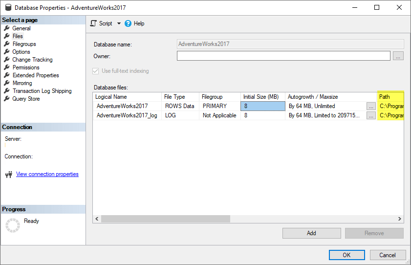{style="display: block; margin: 0 auto"}

 
##### Detach a SQL Server Database Using SSMS
 

 ```
1. First, right click on the database in SSMS which you want to detach and select Tasks > Detach
2. A window will pop up , there are two check boxes
3. Select both checkboxes
4. Select OK.  After the detach occurs, the Status changes to Success.
 ```
 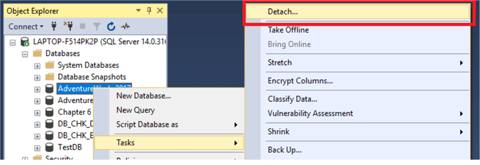{style="display: block; margin: 0 auto"}
 
 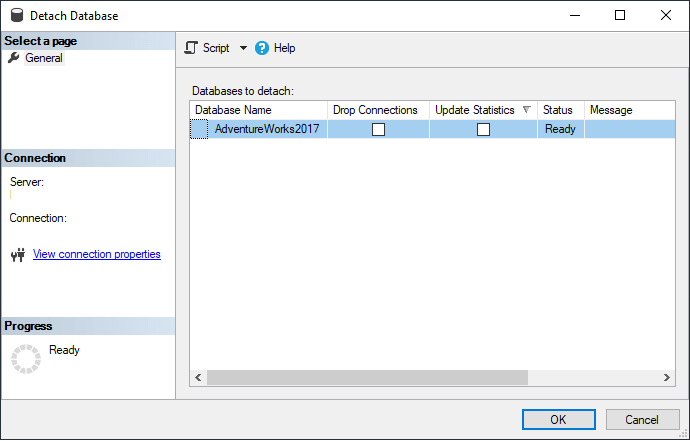{style="display: block; margin: 0 auto"}

  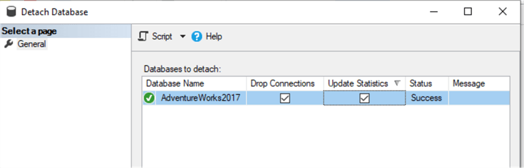{style="display: block; margin: 0 auto"}


  ##### Attach a SQL Server Database Using SSMS
 

 ```
1. To attach the database, right click on Databases and select Attach where you want to attach the database
2. A window will pop up
3. Click on the Add button to find the mdf file that you want to attach, select the file and click OK.
4. SSMS fill then show the associated files for the database as shown below
4. When you have the correct files, click OK and you will see the screen show a green checkmark 

```

 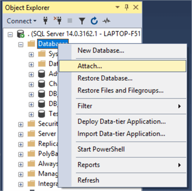{style="display: block; margin: 0 auto"}

 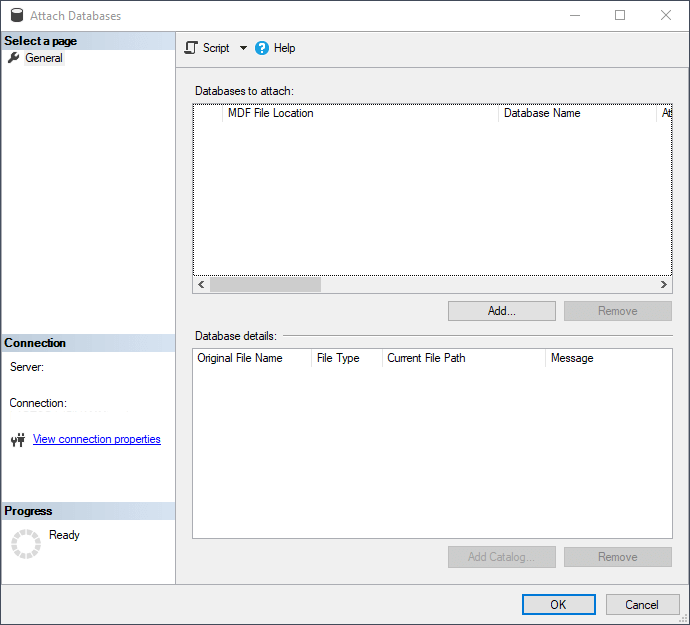{style="display: block; margin: 0 auto"}

 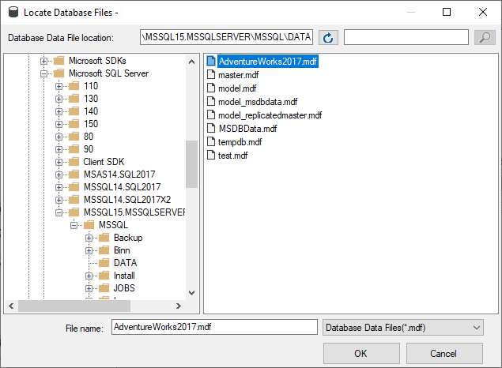{style="display: block; margin: 0 auto"}

  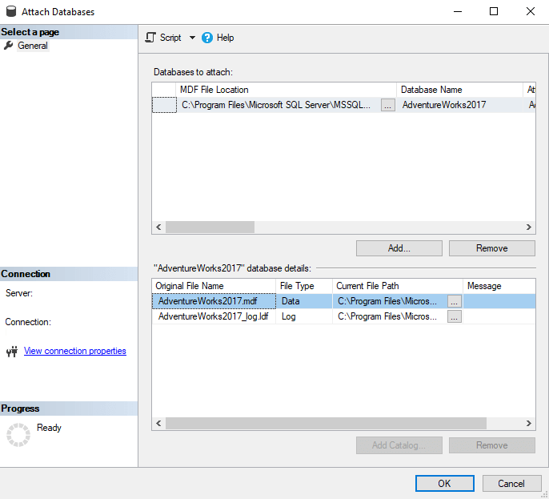{style="display: block; margin: 0 auto"}

  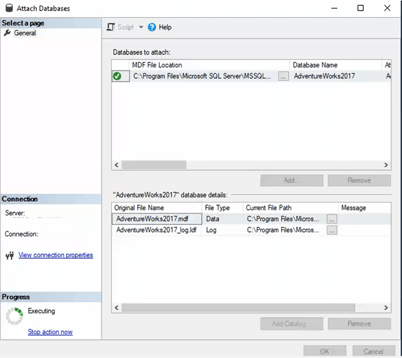{style="display: block; margin: 0 auto"}


  ###### [Attach & Detach]  vs   [Backup & Restore]
 

 ```
- Attach and Detach option works only in SQL Server editions.
- Attach and Detach option database will down, but not backup and restore.
```

</div>

<!---
==================================================================================== فصل دوم
نصب نرم افزارها
-->  

<div style="direction:rtl;font-family:calibri" id="second-chapter-install-softwares"> 

##### II) نصب نرم افزارها

 فایل ها و نرم افزارها به 3 دسته کلی تقسیم شدند که آنها را در سیستم مقصد کپی می کنیم مطابق شکل  

 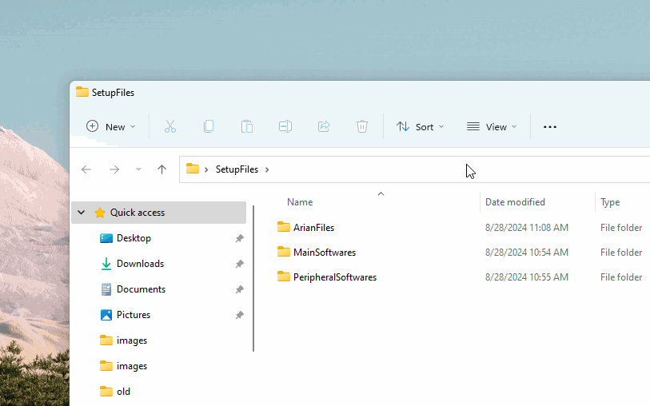{style="display: block; margin: 0 auto"}

 <mark>
نصب نرم افزار های اصلی (Main Softwares) 
</mark>

 
</div>

<div style="direction:ltr;font-family:calibri"> 

##### 1. Install SQL Server(Engine Service)   
###### Pre-Requisites :

```
- Requires Windows 10
-.Net Framework
- 1GB of recommended memory, and NTFS system
```
Step 1: Right click on the ISO file and click on ‘Mount’ to access the package files. 

 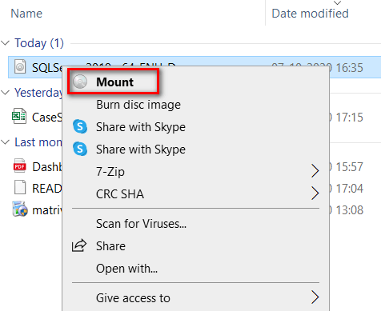{style="display: block; margin: 0 auto"}

 Step 2: Locate the installation package and setup file.

 {style="display: block; margin: 0 auto"}

Step 3: Right click on the setup file, and select "Run As Administrator".

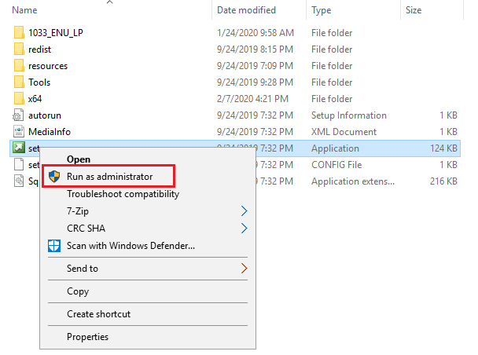{style="display: block; margin: 0 auto"}

Step 4: The SQL Server Installation Center opens.Select the first option:
###### "New SQL Server stand-alone installation or add features to an existing installation"


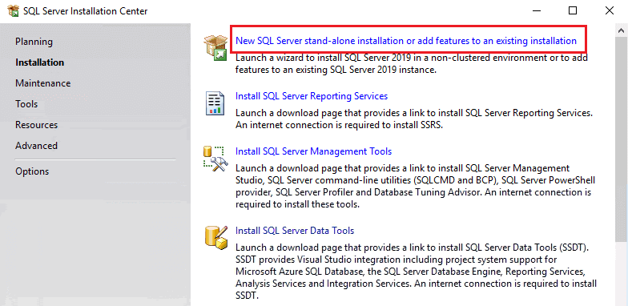{style="display: block; margin: 0 auto"}

Step 5: In the "Product Key" section, choose the "Developer" or "Enterprise" edition and click on "Next".

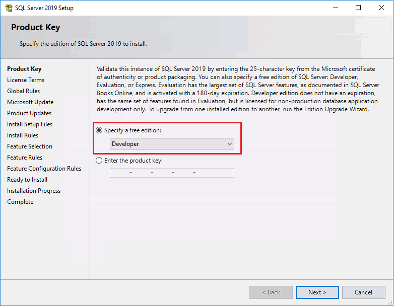{style="display: block; margin: 0 auto"}

Step 6: Accept the license terms and click on "Next".

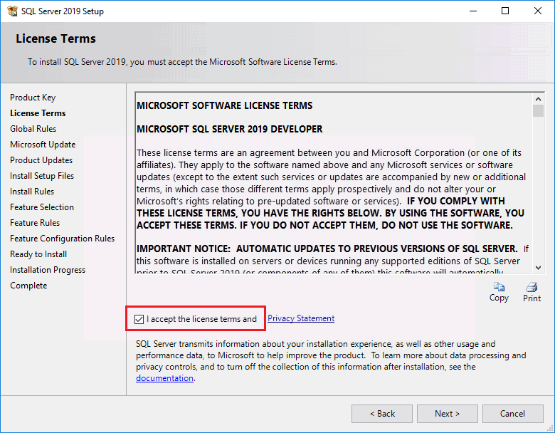{style="display: block; margin: 0 auto"}

Step 7: Make sure all "Global Rules" pass the test and click "Next".

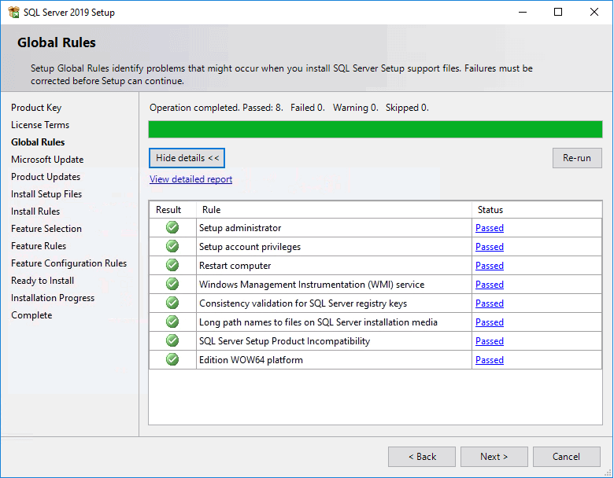{style="display: block; margin: 0 auto"}

Step 8: In the "Microsoft Update" window, enable "Check for Updates" to allow the installer to utomatically check for possible software updates. Click on "Next".

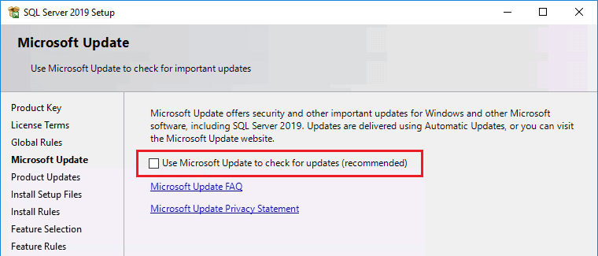{style="display: block; margin: 0 auto"}

Step 9: The setup files will get installed in the next window - Install Setup Files.

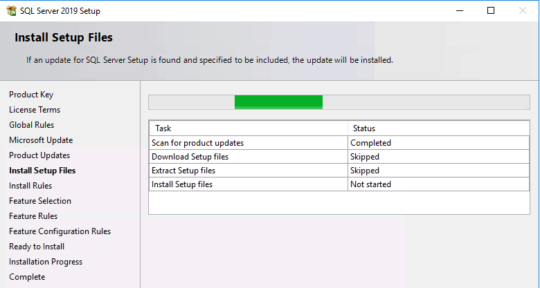{style="display: block; margin: 0 auto"}

Step 10: The "Feature Selection" window allows you to select which SQL Server components will be installed.

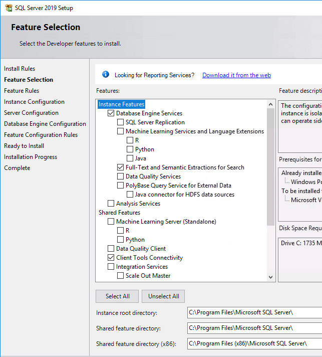{style="display: block; margin: 0 auto"}

Step 11: Select the "Instance features" as shown below, as they are mandatory for SQL Server to work with Visual Expert. Then, click "Next".

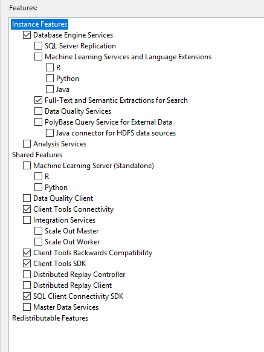{style="display: block; margin: 0 auto"}

Step 12: In the "Instance Configuration" window, create a "VE_Server" Named instance and click "Next".

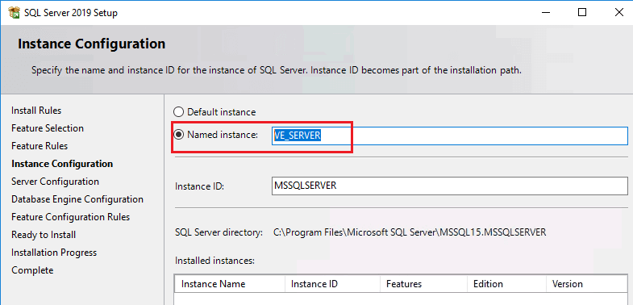{style="display: block; margin: 0 auto"}

Step 13: The "Server Configuration" window allows users to configure Service Accounts.Click "Next" if no change is required in the default account settings.

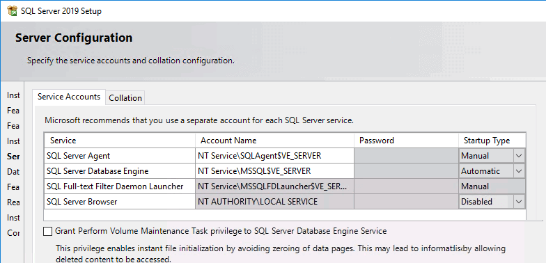{style="display: block; margin: 0 auto"}

Step 14:In the Database Engine Configuration window, under the Server Configuration tab, select "Mixed Mode" authentication.Doing so will allow you to set a password for "System Administrator (sa)" user.

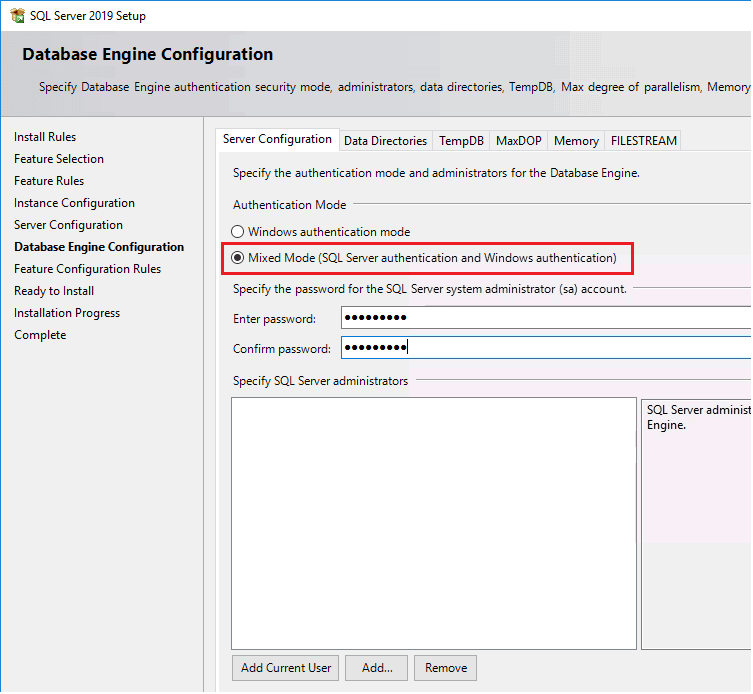{style="display: block; margin: 0 auto"}

Step 15: Click on "Add Current User" to set the current user as Administrator for this SQL Server instance. Then, click "Next".

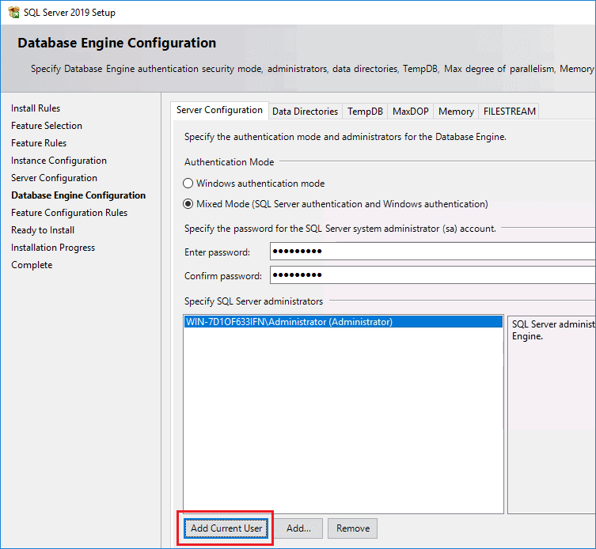{style="display: block; margin: 0 auto"}

Step 16: 
Arriving at the 'Feature Configuration Rules' window, make sure all the Rule(s) pass the installer scanning test. Then, click 'Next'.

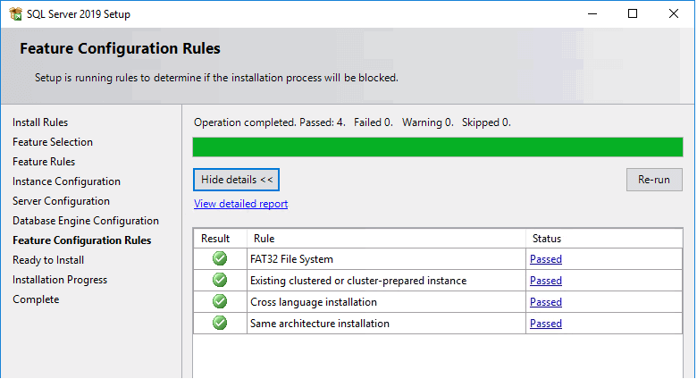{style="display: block; margin: 0 auto"}

Step 17: All configuration steps have been completed. Click "Install" to start the installation.

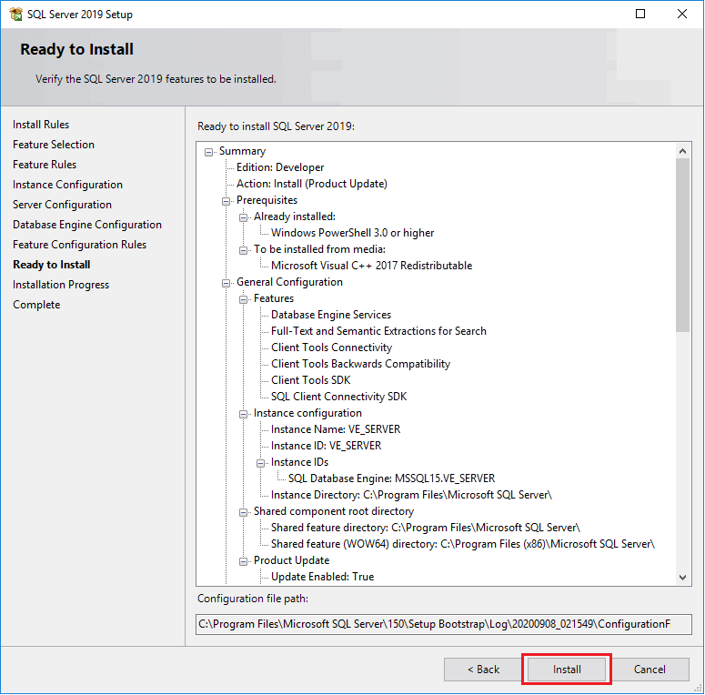{style="display: block; margin: 0 auto"}

Step 18: The installation begins.

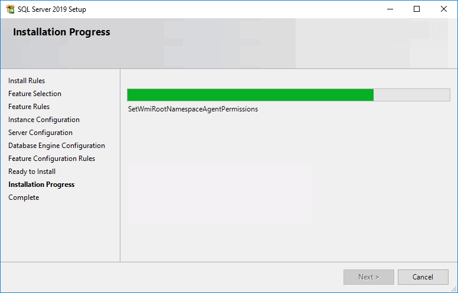{style="display: block; margin: 0 auto"}

Step 19: The installation of SQL Server 2019 Developer Edition is completed.

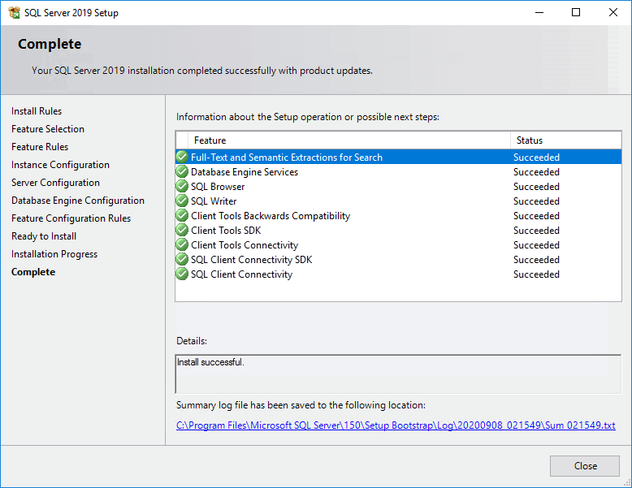{style="display: block; margin: 0 auto"}


<br/>

##### 2. Install SQL Server Management Studio(SSMS)  

Step 1: Right-click on the .exe file that you have downloaded from the website and select Run as administrator.

Step 2: Click Yes if the User Account Control window appears. 

Step 3: Type or Change the directory location to extract the installation files.

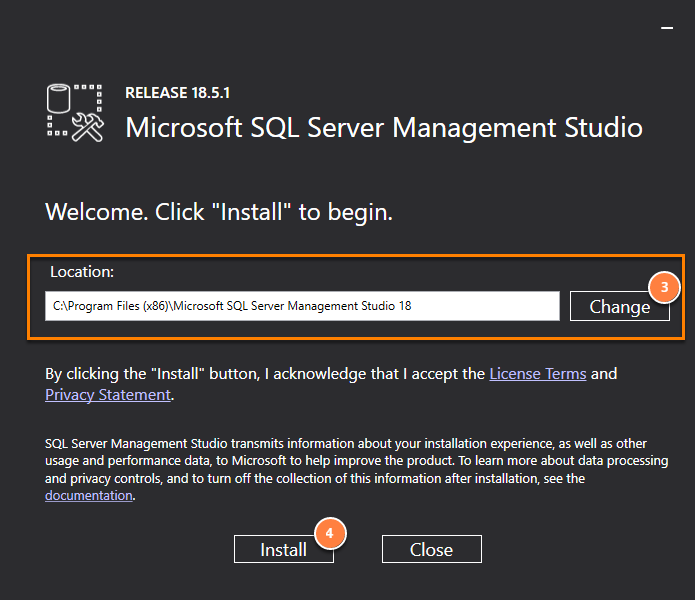{style="display: block; margin: 0 auto"}

Step 4: Click Install and the files will be copied to the selected folder.

Step 5: When the installation is completed, you might need to Restart your computer, otherwise click Close.

{style="display: block; margin: 0 auto"}


##### 3. Install Elastic Search(Service)  
 
 Step 1: Download ElasticSearch from Link: https://www.elastic.co/downloads/elasticsearch

 Step 2: After Download and Extract go to 'config' folder append following settings:

 ```
node.name: master
node.master: true
network.host: 0.0.0.0 #  
cluster.initial_master_nodes: ["master"]
xpack.license.self_generated.type: basic
 ``` 

 Step 3: Go to 'bin' folder and open command prompt from here

 Step 4: Execute following command :
 ```
 .\elasticsearch-service.bat install
 ```

 Step 5: if you have seen following message means:'ElasticSearch has been installed successfully'
```
The service 'elasticsearch-service-x64' has been installed.
```

Step 6: After that execute following command :
```
.\elasticsearch-service.bat manager
```

Step 7: Go to services and find 'Elasticsearch' service then set startup on automatic

Step 8: At the finally go to browser and typing http://localhost:9200 you can see following page :

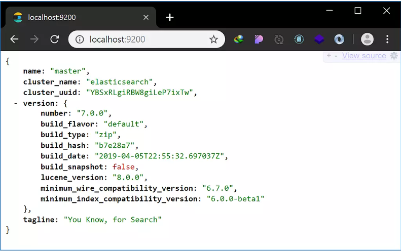{style="display: block; margin: 0 auto"}


##### 4. Install IIS (Internet Information Services) 

Step 1: Click on the search bar and type "Control Panel"

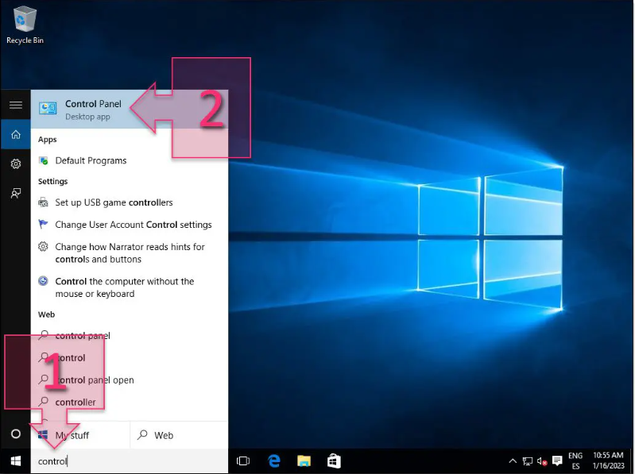{style="display: block; margin: 0 auto"}

Step 2: Double-click on "Programs and Features"

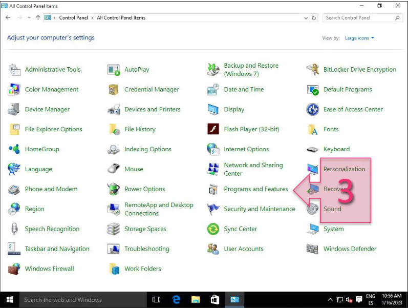{style="display: block; margin: 0 auto"}

Step 3 :A new window will appear. Click on "Turn Windows features on or off"

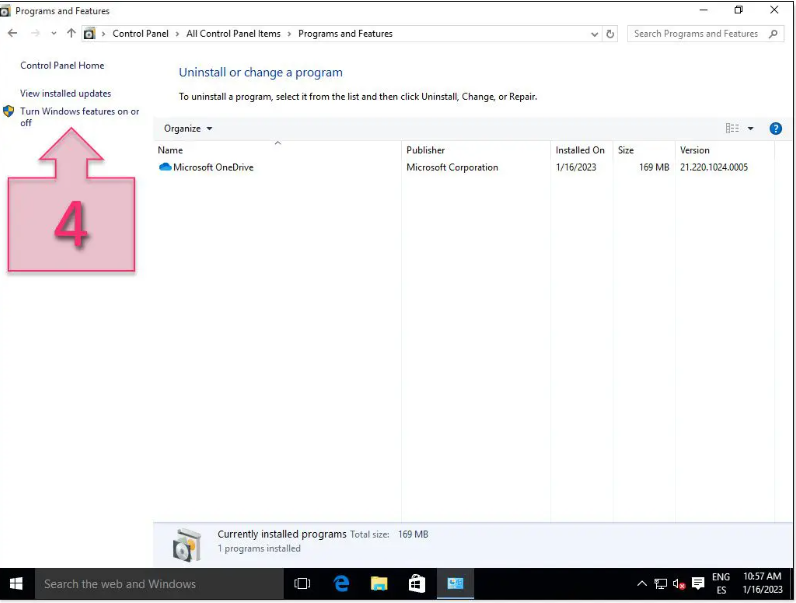{style="display: block; margin: 0 auto"}

Step 4 :Expand the "Internet Information Services" node and make sure the following features are selected.

```
- IIS Management Console
- .NET Extensibility 4.8
- Application Initialization
- ASP.NET 4.8
- ISAPI Extensions
- ISAPI Filters
- Default Document
- Static Content
```
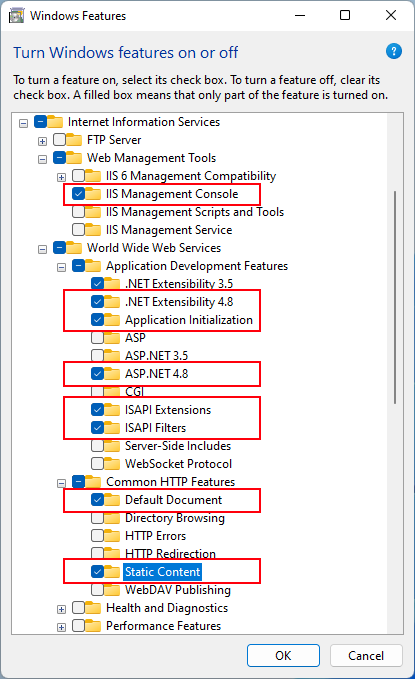{style="display: block; margin: 0 auto"}
 

Step 5 : Checking That IIS Has Been Installed Correctly ?
<mark>First Method :</mark> Open your web browser and type "127.0.0.1" or "http://localhost/" in the address bar

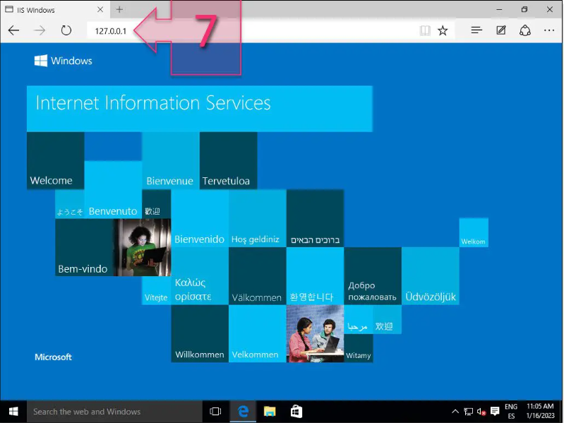{style="display: block; margin: 0 auto"}

<mark>Second Method :</mark>  If exists 'iis' in search bar then iis have been installed successfully

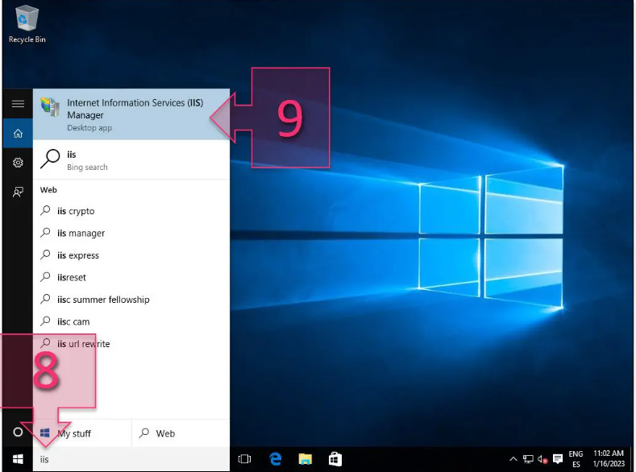{style="display: block; margin: 0 auto"}

 
  ##### 4. Host Project() 

 ```
1. Go to this path: 'C:\inetpub\wwwroot'
2. Create two folders named 'Portal' ,'Management'
3. Copy paste project of 'portal' to portal folder and project of 'management' to management foler
4. Set connectionString of two project
 ```

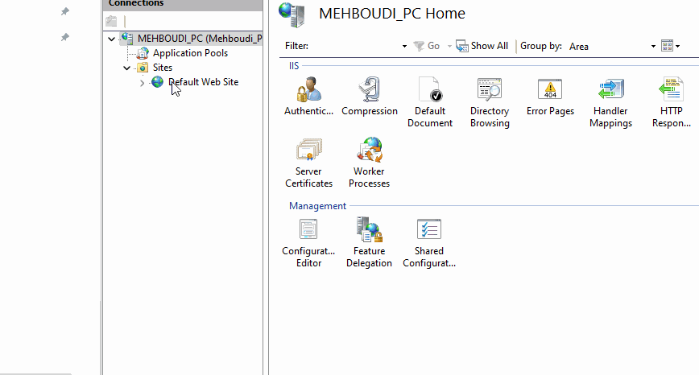{style="display: block; margin: 0 auto"}

 ##### 5. Install Indexer() 
 in visual studio  go to 'Solution Explorer' find this project: `PayamHannan.Arian.ElasticSearchManager.Indexer`
 
 ```
1. Right click on the project and select 'build' menu
2. After finishing build,right click on the project and select 'open folder in file explorer' menu
3. Go to this path Bin>Debug and copy this '.exe' file: 'PayamHannan.Arian.ElasticSearchManager.Indexer.exe'
4. Paste this '.exe' file to 'SetupFiles' folder
 ```

 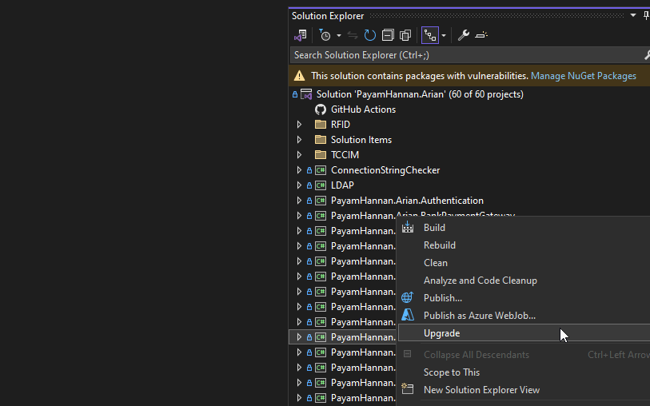{style="display: block; margin: 0 auto"}


<div>

<!---
======================================================================================== فصل سوم
آپدیت آریان
-->  
 <div style="direction:rtl;font-family:calibri" id="third-chapter-update-arian">

 ##### III)   آپدیت آریان  


</div>
 <div style="direction:ltr;font-family:calibri" >
اصلاح شود با توجه به پوشه درست شود .
 ```
1. Go to this path: 'C:\inetpub\wwwroot'
2. Open file 'ConnectionString.json' and check (Be Sure! this ConnectionString want to update)
3. Run Bupdater with Run As Administrator
4. Select 'Portal Name' and 'Management' from dropdownlist
5. Select file with extension '.Aup'
6. Hit 'Start Update' button
7. After while A black window will pop up  and prompt 'press any key'
8. Press every charcter
9. A White widwow will pop up named 'ScriptOutput.sql'
10. Ctrl+a select whole page and copy in 'new query'
11. Go to main menu of ssms and select Query > SqlMode
12. At the finally run query after that you will see message 'query executed successfully'.

 ```


 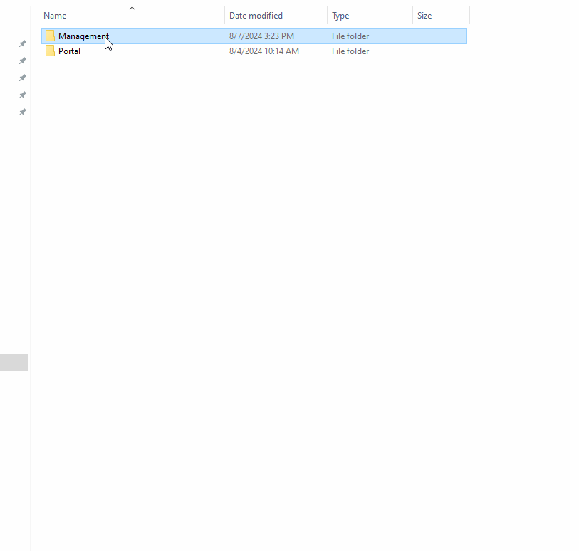{style="display: block; margin: 0 auto"}


 </div>
