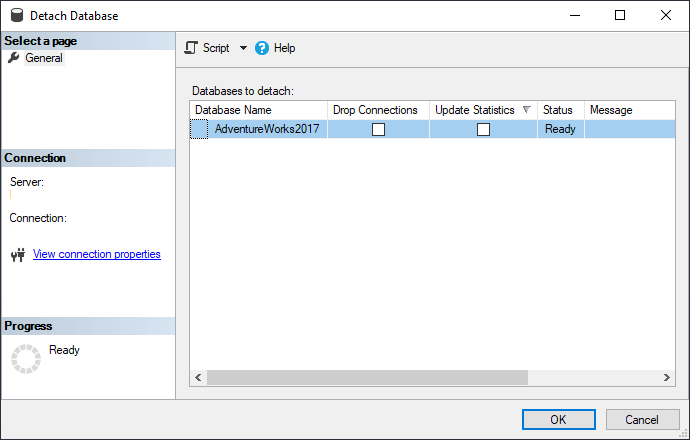
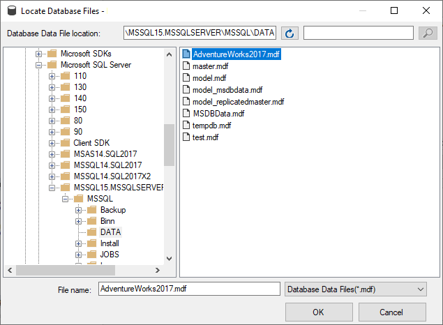
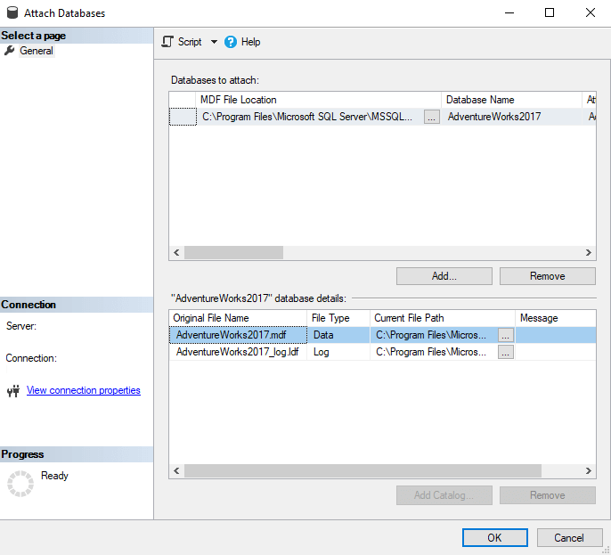
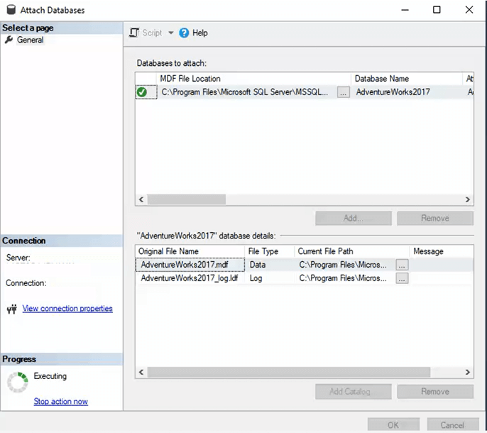

<div style="direction:rtl;font-family:calibri"> 
 

# Development Part
 این سامانه تحت وب می باشد که از زبانها و تکنولوژی های زیر ساخته شده است :
</div>

<div style="direction:ltr;font-family:calibri"> 

```
- C#
- Asp.net mvc
- Asp.net webform
- TSQL
- Elastic Search
- SignalR
- HTML
- CSS
- Bootstrap
- Javascript
- Typescript
- JQuery
- Stimul Soft
```

</div>
<div style="direction:rtl;font-family:calibri"> 

## I)  فصل اول (پروسه نصب)
 برای راه اندازی این سامانه نیازمند خروجی اپلیکیشن و پایگاه داده را داریم  :
ابتدا پروژه را روی branch یPublish می گذاریم


<mark>
 گرفتن خروجی اپلیکیشن : 
</mark>
 

##### فرآیند پابلیش اپلیکیشن  


پابلیش `Portal(Frontend)` 

</div>
<div style="direction:ltr;font-family:calibri"> 

```
1. Execute 'Visual Studio'
2. Go to main menu and select 'view' 
3. Select 'Solution Explorer'
4. In right side a window will appear that contins alot of projects
5. Select one project that named 'PayamHannan.Arian.Portal.Web'
6. Right click and select 'publish'
7. A window will pop up containing several options,please 'Folder' option
8. A window will appear asking for the 'path' address that will generate the publish files 
9. At the end, press the 'publish' button
```
 {style="display: block; margin: 0 auto"}

</div>

<div style="direction:rtl;font-family:calibri"> 

پابلیش  `Management(backend)` 
</div>

<div style="direction:ltr;font-family:calibri"> 

```
1. In 'Visual Studio'
2. Go to main menu and select 'view' 
3. Select 'Solution Explorer'
4. In right side a window will appear that contins alot of projects
5. Select one project that named 'PayamHannan.Arian.Management.WebSite'
6. Right click and select 'publish'
7. A window will pop up containing several options,please 'Folder' option
8. A window will appear asking for the 'path' address that will generate the publish files 
9. at the end, press the 'publish' button

```

 {style="display: block; margin: 0 auto"}

</div>

<div style="direction:rtl;font-family:calibri"> 


پشتیبان گیری `Database(backup)` 

</div>
<div style="direction:ltr;font-family:calibri"> 

Backup is designed to provide a complete copy of the database without any downtime.
```
1. In the start menu,type 'SSMS'
2. The 'Sql Server Management Studio' will run
3. A window will pop up asking 'connection' info
4. After entering the correct information int the left side A window named 'Object Explorer' will appear
5. Select prefered database like 'ArianLibarary' then right click select menu 'task' after that select menu 'Backup'
6. A window will appear that asking for 'path' address that will backup
 
```

  {style="display: block; margin: 0 auto"}
 
 </div>

<div style="direction:rtl;font-family:calibri"> 

کپی فایلها `Database(detach/attach)` 
: قبل از جدا کردن یک دیتابیس، باید اطلاعاتی در مورد مسیر فایل های  ذخیره شده آن دیتابیس را به دست آورید مانند شکل زیر 
  </div>
 ```

 <div style="direction:ltr;font-family:calibri"> 
1. In SQL Server Management Studio, right click on the database and select 'Properties'
2. Left side  go to the 'Files' menu
3. You can see a list of database files and the 'Path' where the files currently exist
 ```

  {style="display: block; margin: 0 auto"}

 
##### Detach a SQL Server Database Using SSMS
 

 ```
1. First, right click on the database in SSMS which you want to detach and select Tasks > Detach
2. A window will pop up , there are two check boxes
3. Select both checkboxes
4. Select OK.  After the detach occurs, the Status changes to Success.
 ```
 {style="display: block; margin: 0 auto"}
 
 {style="display: block; margin: 0 auto"}

  {style="display: block; margin: 0 auto"}


  ##### Attach a SQL Server Database Using SSMS
 

 ```
1. To attach the database, right click on Databases and select Attach where you want to attach the database
2. A window will pop up
3. Click on the Add button to find the mdf file that you want to attach, select the file and click OK.
4. SSMS fill then show the associated files for the database as shown below
4. When you have the correct files, click OK and you will see the screen show a green checkmark 

```
 {style="display: block; margin: 0 auto"}

 {style="display: block; margin: 0 auto"}

 {style="display: block; margin: 0 auto"}

  {style="display: block; margin: 0 auto"}

  {style="display: block; margin: 0 auto"}


  ###### [Attach & Detach]  vs   [Backup & Restore]
 

 ```
- Attach and Detach option works only in SQL Server editions.
- Attach and Detach option database will down, but not backup and restore.
```
</div>


<div style="direction:rtl;font-family:calibri"> 


##   II) فصل دوم (پروسه Update)
 برای آپدیت این سامانه نیازمند  پکیج زیر داربم:
  <mark>
  پکیج aup 
</mark>

#####  مرحله اول :
ابتدا پروژه را روی branch ی **Update** می گذاریم
 
همون پروسه پابلیش  ها را که در مرحله  نصب انجام دادیم، را انجام می دهیم
 
#####  مرحله دوم :

تغییرات پایگاه داده را کپی می کنیم
</div>

<div style="direction:dtr;font-family:calibri"> 

```
1. Go to 'Solution Explorer' and right click on 'PayamHannan.Arian.SqlServerDatabase' project then hit 'Build'
2. After finishing Build right click on 'PayamHannan.Arian.SqlServerDatabase' project and select 'Open Folder in File Explorer'
3. Go to this directories Bin>Debug and copy two files with extension .'dacpac' are named 'PayamHannan.Arian.SqlServerDatabase.dacpac','master.dacpac' 
4. Paste these files in root of  directories like following image 
```

  {style="display: block; margin: 0 auto"}
</div>

  <div style="direction:rtl;font-family:calibri"> 

##### مرحله آخر (تولید پکیج)

</div>

  <div style="direction:ltr;font-family:calibri"> 

  ```
  1. Right click on 'PayamHannan.Arian.SqlServerDatabase.dacpac' file and rename to 'sql.dacpac'
  2. Press ctrl+a in directory of publish and extract to '.zip'
  3. Extension of  zip file rename to '.aup'
  ```

  {style="display: block; margin: 0 auto"}

  </div>

  <div style="direction:rtl;font-family:calibri"> 
 <mark> 
  Copy Indexer
   </mark>
</div>

  <div style="direction:ltr;font-family:calibri"> 

 in visual studio  go to 'Solution Explorer' find this project: `PayamHannan.Arian.ElasticSearchManager.Indexer`
 
 ```
1. Right click on the project and select 'build' menu
2. After finishing build,right click on the project and select 'open folder in file explorer' menu
3. Go to this path Bin>Debug and copy this '.exe' file: 'PayamHannan.Arian.ElasticSearchManager.Indexer.exe'
4. Paste this '.exe' file to 'SetupFiles' folder
 ```

 {style="display: block; margin: 0 auto"}
</div>


  <div style="direction:rtl;font-family:calibri"> 
 <mark> 
  Use Indexer
   </mark>
</div>

<div style="direction:ltr;font-family:calibri"> 

 
 
 ```
1. Copy 'PayamHannan.Arian.ElasticSearchManager.Indexer.exe' file to this path : '\WWWWRoot\Management'
2. Right click and 'run as administrator' 
3. A black window will appear and prompt : Enter itemId ranges 
4. Go to Sql Server and run this query `SELECT min(itemId) as minItemId,max(itemId) as maxItemId FROM [tblEditableDocuments]`
5. Go to indexer black window
 
```
 {style="display: block; margin: 0 auto"}
</div>
